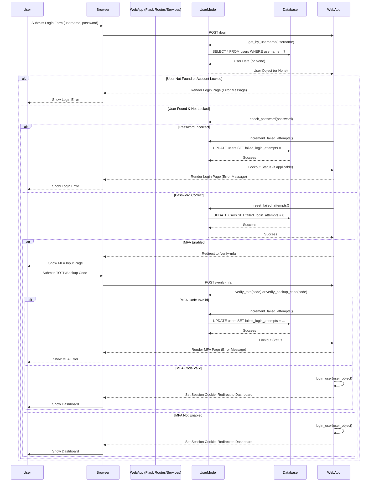
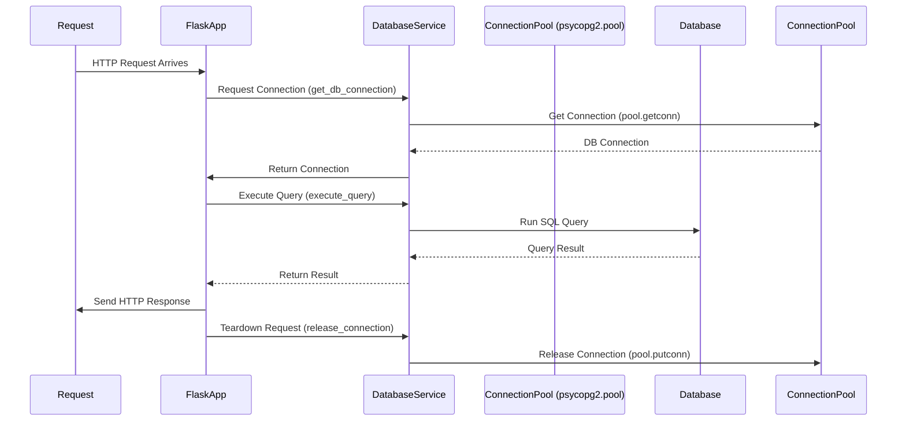
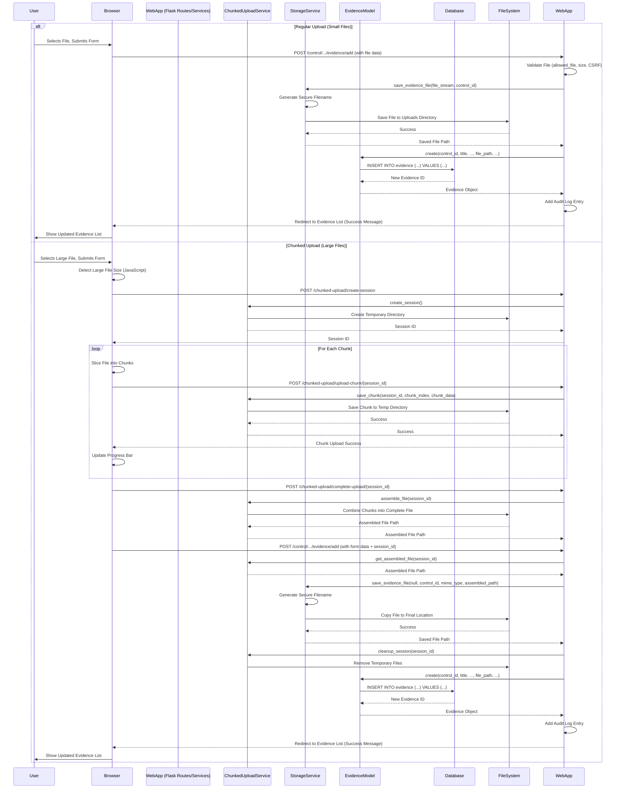
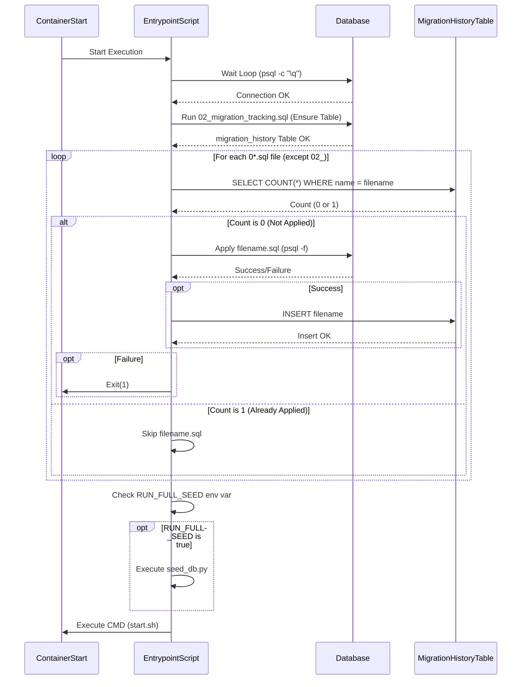

# System Patterns: CMMC Compliance Tracker

## Architecture Overview

The CMMC Compliance Tracker follows a modular, layered web application architecture based on Flask.

**Directory Structure:**

```
cmmc_tracker/
├── app/                 # Core application package
│   ├── models/          # Data models (e.g., User, Control, Task, Evidence, AuditLog)
│   ├── routes/          # Flask Blueprints defining application endpoints
│   ├── services/        # Business logic modules (e.g., database, email, auth, storage)
│   ├── templates/       # Jinja2 HTML templates for the UI
│   ├── utils/           # Utility functions (e.g., date handling, security helpers)
│   └── __init__.py      # Application factory (create_app function)
├── db/                  # SQL migration scripts (0*.sql)
├── uploads/             # Default directory for storing uploaded evidence files
├── config.py            # Configuration classes (Base, Dev, Test, Prod)
├── run.py               # Application entry point (used by Gunicorn/Flask dev server)
├── requirements.txt     # Python dependencies
├── Dockerfile           # Instructions for building the web application container
├── docker-compose.yml   # Defines services (web, db, redis) and orchestration
├── docker-entrypoint.sh # Script run on container start (DB wait, migrations)
└── start.sh             # Script to start Gunicorn (executed by entrypoint)
```

**Layered Architecture Diagram:**

```mermaid
graph TD
    subgraph "User Interface"
        UI[Browser]
    end

    subgraph "Presentation Layer (Flask)"
        direction TB
        R[Routes (Blueprints)]
        T[Templates (Jinja2)]
    end

    subgraph "Business Logic Layer"
        direction TB
        S[Services]
        M[Models]
        U[Utils]
    end

    subgraph "Data Access Layer"
        direction TB
        DS[Database Service (`database.py`)]
        CP[Connection Pool (`psycopg2.pool`)]
    end

    subgraph "Infrastructure"
        direction TB
        DB[(PostgreSQL)]
        RD[(Redis)]
        FS[(File System)]
    end

    UI --> R;
    R --> T;
    R --> S;
    S --> M;
    S --> U;
    S --> DS;
    M --> DS;
    DS --> CP;
    CP --> DB;
    S --> RD;  // e.g., Rate Limiting, Caching
    S --> FS;  // e.g., Evidence Storage
```

- **Presentation Layer**: Handles HTTP requests via Flask routes (organized into Blueprints) and renders HTML responses using Jinja2 templates.
- **Business Logic Layer**: Contains the core application logic within Service modules (`app/services/`). Models (`app/models/`) define data structures and encapsulate data-related logic (acting as part of a custom Repository pattern). Utility functions (`app/utils/`) provide reusable helpers.
- **Data Access Layer**: Abstracted through a custom Database Service (`app/services/database.py`) which manages interactions with the PostgreSQL database via a `psycopg2` connection pool.
- **Infrastructure**: Consists of the underlying services managed by Docker Compose: PostgreSQL database, Redis (for rate limiting, potentially caching/queues), and the local filesystem (for evidence storage).

## Design Patterns

### Model-View-Controller (MVC)
- **Models**: Custom model classes in `app/models/` define the data structure and interact with the database service
- **Views**: Jinja2 templates in `app/templates/` render the UI
- **Controllers**: Route handlers in `app/routes/` process requests

### Application Factory
- Centralized application initialization in `app/__init__.py`
- Supports multiple configurations (development, testing, production)
- Modular extension registration
- Security headers added via `@app.after_request` decorator

### Blueprint Pattern
- Routes organized into logical blueprints (auth, admin, controls, evidence, etc.)
- Each blueprint handles a specific functional area
- Improves code organization and maintainability
- Blueprints registered in `app/__init__.py` through `register_blueprints()` function

### Service Layer
- Business logic isolated in service modules
- Separates application logic from route handlers
- Improves testability and code reuse
- Key services include:
  - `database.py`: Database connection and operations
  - `email.py`: Email notification handling
  - `audit.py`: Audit logging
  - `mfa.py`: Multi-factor authentication
  - `storage.py`: File storage operations
  - `chunked_upload.py`: Chunked file upload handling
  - `scheduler.py`: Background task scheduling

### Repository Pattern
- Data access logic encapsulated in model classes
- Standard methods for CRUD operations
- Abstracts database interactions from business logic
- Model classes use the database service (`database.py`) for SQL operations
- Follows a custom Repository Pattern implementation without a dedicated ORM like SQLAlchemy. Model classes contain methods (e.g., `get_by_id`, `create`, `update`) that interact directly with the `database.py` service to execute SQL queries.

### Database Connection Pooling
- Implemented using `psycopg2.pool.ThreadedConnectionPool`
- Connection pool initialized at application startup
- Global connection pool with thread safety via mutex lock
- Uses thread-local storage (`threading.local`) to manage database connections per request thread, ensuring isolation and efficient reuse within a single request lifecycle.
- Connections managed based on request context lifecycle
- Proper connection release back to pool during request teardown
- Configurable minimum and maximum pool size via environment variables
- Connection acquisition with thread-specific keys
- Comprehensive error handling and logging
- Automatic cleanup during application shutdown via atexit module
- Avoids common connection leaks with proper teardown registration
- Supports high-concurrency workloads with efficient connection reuse
- Implements automatic Docker container name resolution for testing environments
- Fallback mechanism attempts connection with Docker-generated container names (e.g., `python-grc-b-db_test-1`) if standard service name fails

## Key Components

### Authentication System
- Flask-Login for session management
- Password hashing with Werkzeug
- TOTP-based multi-factor authentication
- Backup codes for MFA recovery
- Admin MFA reset capability
- Rate limiting for security
- Redis-backed rate limiting persistence
- Password strength validation
- Account lockout after multiple failed login attempts
- Automatic account unlock after timeout period
- Admin capability to manually unlock accounts

### Database Schema
- Relational schema with SQLite (dev) and PostgreSQL (prod)
- Foreign key relationships for data integrity
- Indexes for performance optimization
- Migration support for schema evolution
- Main tables include:
  - `users`: User accounts and authentication
  - `controls`: CMMC compliance controls
  - `tasks`: Compliance tasks and assignments
  - `evidence`: Evidence files and metadata
  - `auditlogs`: System activity tracking

### File Storage
- Local file system storage for evidence files
- Secure file naming and organization
- File metadata tracked in database
- Status tracking (Current, Pending Review, Expired)
- **File type validation:** Includes checks for allowed extensions (config: `ALLOWED_EXTENSIONS`), content validation via magic numbers (config: `ALLOWED_MIME_TYPES`, uses `python-magic`), and size limits (config: `MAX_CONTENT_LENGTH`).
- Secure file download through Flask's `send_file`

### Task Scheduling
- Flask-APScheduler for periodic tasks
- Notification sending and status updates
- Automatic report generation
- Daily task deadline notifications configured

### Rate Limiting
- Flask-Limiter for request throttling
- Redis backend for persistent storage
- Configurable limits for different endpoints
- Protection against brute force attacks
- Specific limits defined per route

### MFA System
- PyOTP library for TOTP implementation
- QR code generation for easy setup
- Backup codes for recovery
- Admin reset capability
- TOTP verification during login
- Session-based MFA verification flow

### Account Lockout System
- Tracks failed login attempts in database
- Automatic lockout after configurable number of failed attempts (default: 5)
- Configurable lockout duration (default: 15 minutes)
- Failed attempts count reset on successful login
- Admin interface for viewing locked accounts
- Admin capability to manually unlock accounts
- Automatic unlock after lockout period expires
- Comprehensive audit logging of lockout events

## Data Flow Patterns

### User Authentication Flow (Login with MFA & Lockout)



### Database Connection Flow (Request Lifecycle)



### Evidence Upload Flow



### Control Management Flow (Simplified CRUD)
1. User navigates to control list or detail page.
2. **Read:** `Control.get_all()` or `Control.get_by_id()` retrieves data via `database.py`.
3. **Create/Update:** User submits form, route handler validates, calls `Control.create()` or `control_instance.update()`, which uses `database.py` to run INSERT/UPDATE. Audit log entry added.
4. **Delete:** User confirms deletion, route handler calls `control_instance.delete()`, which uses `database.py` to run DELETE. Audit log entry added.
5. Changes are reflected in subsequent reads.

### Reporting Flow (Simplified)
1. User requests a report (e.g., CSV export) via a specific route.
2. Route handler calls relevant Model methods (e.g., `Control.get_all()`) to fetch data.
3. Data is formatted (e.g., into CSV string or JSON).
4. Flask response is generated with appropriate headers (e.g., `Content-Disposition`) to trigger download or display.

### Calendar View Flow
1. User navigates to the calendar route.
2. Route handler fetches relevant data (e.g., `Control.get_all()` for review dates, `Task.get_all()` for due dates).
3. Data is processed and passed to the Jinja2 template.
4. Template renders the calendar UI, potentially using JavaScript for interactivity, displaying events based on dates and statuses.

## Security Patterns

1. **Defense in Depth**: Multiple security layers including authentication, authorization, and input validation
2. **Principle of Least Privilege**: Role-based access control limits user permissions
3. **Secure by Default**: Sensible security defaults with explicit opt-out where needed
4. **Complete Mediation**: All requests pass through authentication and authorization checks
5. **Audit Trail**: Comprehensive logging of security-relevant events
6. **Rate Limiting**: Protection against brute force and DoS attacks
7. **Content Security Policy**: Protection against XSS and other injection attacks
8. **Multi-Factor Authentication**: Additional verification beyond passwords
9. **Password Strength Enforcement**: Prevention of weak passwords
10. **One-Time Token Pattern**: Secure password reset process
11. **Parameterized Queries**: Protection against SQL injection
12. **Input Sanitization**: Cleaning user input to prevent injection attacks
13. **Account Lockout**: Temporary account lockout after multiple failed authentication attempts
14. **Progressive Timeouts**: Increasing lockout durations for repeated authentication failures
15. **Administrative Override**: Admin capability to unlock accounts in legitimate cases
16. **Connection Pooling**: Efficient database connection management for performance and security
17. **Query Profiling**: Performance monitoring for database operations
18. **In-memory Caching**: Temporary storage of frequently accessed data
19. **Common Table Expressions**: SQL optimization technique for complex queries

## Performance Optimization Patterns

The application implements several patterns to optimize performance and provide visibility into system behavior:

### Query Profiling Pattern

A lightweight profiling system measures and logs database query execution times:

1. **Timer Management**: The profiler maintains timers in Flask's `g` object, scoped to the current request.
2. **Query Naming**: Each database query can be assigned a name for identification in profiling data.
3. **Execution Timing**: Start and stop times are recorded for each query execution.
4. **Threshold Logging**: Queries exceeding a configurable threshold (default: 100ms) are logged as slow queries.
5. **Statistics Collection**: The profiler maintains running statistics (min, max, avg, count) for each query type.
6. **Admin Dashboard**: A dedicated admin page displays profiling data for performance analysis.

**Implementation:**

```python
# In profiler.py
def start_timer(name):
    if not hasattr(g, 'timers'):
        g.timers = {}
    g.timers[name] = time.time()

def stop_timer(name):
    if hasattr(g, 'timers') and name in g.timers:
        elapsed = time.time() - g.timers[name]
        # Store statistics
        if elapsed > SLOW_QUERY_THRESHOLD:
            logger.debug(f"Slow query: {name} took {elapsed:.4f}s")
        return elapsed
    return None

# In database.py
def execute_query(query, params=None, query_name=None, ...):
    timer_name = f"db_query_{query_name or 'unnamed'}"
    start_timer(timer_name)
    # Execute query...
    elapsed = stop_timer(timer_name)
```

### In-memory Caching Pattern

The dashboard implements a simple in-memory caching mechanism to reduce database load:

1. **Cache Storage**: Dashboard data is stored in a module-level dictionary.
2. **Time-based Expiration**: Cache entries include a timestamp and are considered valid for a configurable TTL.
3. **Transparent Access**: The dashboard route checks for valid cached data before executing database queries.
4. **Automatic Refresh**: When cache is invalid or missing, fresh data is fetched and cached.

**Implementation:**

```python
# In controls.py
_dashboard_cache = {}
_cache_timestamp = None
_cache_ttl = 60  # seconds

def dashboard():
    # Check for valid cache
    current_time = time.time()
    if _cache_timestamp and (current_time - _cache_timestamp) < _cache_ttl:
        return render_template('dashboard.html', **_dashboard_cache)

    # Cache miss - fetch fresh data
    # ... execute queries and prepare data ...

    # Update cache
    _dashboard_cache = {'metrics': metrics, 'activities': activities, ...}
    _cache_timestamp = current_time

    return render_template('dashboard.html', **_dashboard_cache)
```

### SQL Optimization Patterns

The application uses several SQL optimization techniques:

1. **Common Table Expressions (CTEs)**: Complex queries are structured using CTEs for readability and performance.
2. **Aggregation Pushdown**: Calculations are performed in SQL rather than Python where possible.
3. **Parameterized Queries**: All queries use parameters to enable query plan caching by the database.
4. **Minimal Data Transfer**: Queries select only the specific columns needed rather than using `SELECT *`.

**Example CTE Query:**

```sql
WITH domain_mapping AS (
    SELECT
        controlid,
        CASE WHEN controlid LIKE 'AC-%' THEN 'Access Control' ... END as domain
    FROM controls
),
control_status AS (
    SELECT
        c.controlid,
        dm.domain,
        CASE
            WHEN COUNT(t.taskid) = 0 THEN 'Not Assessed'
            WHEN SUM(CASE WHEN t.status IN ('Open', 'Pending Confirmation') THEN 1 ELSE 0 END) > 0 THEN 'In Progress'
            WHEN SUM(CASE WHEN t.status = 'Completed' AND t.confirmed = 1 THEN 1 ELSE 0 END) > 0 THEN 'Compliant'
            ELSE 'Non-Compliant'
        END as status
    FROM controls c
    JOIN domain_mapping dm ON c.controlid = dm.controlid
    LEFT JOIN tasks t ON c.controlid = t.controlid
    GROUP BY c.controlid, dm.domain
)
SELECT domain, COUNT(*) as total, SUM(...) as compliant, ... FROM control_status GROUP BY domain;
```

## Database Migration & Seeding Pattern

The application uses a simple, automated SQL-based migration system executed by the `docker-entrypoint.sh` script upon container startup.

**Migration Process:**

1.  **Wait for Database:** The entrypoint script first waits until it can successfully connect to the PostgreSQL database service.
2.  **Ensure Tracking Table:** It runs `db/02_migration_tracking.sql` to guarantee the `migration_history` table exists. This table stores the filenames of applied migrations.
3.  **Iterate & Apply:** The script iterates through all files matching `db/0*.sql` in numerical order.
4.  **Check History:** For each script (excluding `02_...`), it queries the `migration_history` table to see if the script's filename is already recorded.
5.  **Execute Pending:** If a script is *not* found in the history table, it's considered pending and is executed using the `psql` client.
6.  **Record Success:** Upon successful execution of a script, its filename is inserted into the `migration_history` table. If execution fails, the entrypoint script exits with an error.

**Key Characteristics:**

-   **SQL-Based:** Migrations are plain SQL scripts.
-   **Version Tracking:** Relies on the `migration_history` table and sequential filenames (`01_`, `02_`, etc.).
-   **Automated:** Runs automatically on container start via `docker-entrypoint.sh`.
-   **Idempotency:** SQL scripts often use `IF NOT EXISTS` or similar checks to be safely re-runnable, although the history table prevents actual re-application.

**Database Seeding:**

-   After migrations complete, the `docker-entrypoint.sh` script checks the `RUN_FULL_SEED` environment variable.
-   If `RUN_FULL_SEED` is set to `true` (or `yes` or `1`), the script executes `python /app/seed_db.py`.
-   `seed_db.py` populates the database with initial data (default users, controls from JSON, sample tasks) but includes checks to avoid duplicating existing data (e.g., users with the same username).

**Migration Execution Diagram:**



## UI Design Patterns

1. **Responsive Design**: Works across device sizes
2. **Dashboard Pattern**: Quick overview of key metrics
3. **Card-Based Layout**: Information organized in intuitive cards
4. **Color Status Indicators**: Visual feedback about status
5. **Paginated Tables**: Handling large datasets efficiently
6. **Interactive Calendar**: Visual representation of scheduled events
7. **Progress Bars**: Visual representation of metrics
8. **Badges**: Compact status indicators
9. **Flash Messages**: Immediate user feedback for actions
10. **Status Indicators**: Visual cues for account lockout status

## Codebase Observations & Potential Refinements

*(Note: These are observations for context and potential future improvements, not necessarily issues requiring immediate action.)*

1.  **Migration History Table Name:** The migration script `db/05_account_lockout_migration.sql` contains commented-out code (lines 32-44) attempting to insert into a table named `migrations`, while the actual tracking table created by `db/02_migration_tracking.sql` and used by `docker-entrypoint.sh` is `migration_history`. This suggests leftover code from a previous approach and could be removed from `05_...sql` for clarity.
2.  **Seeding Script Redundancy:** The `seed_db.py` script includes a `create_tables` function which duplicates the table creation logic already handled by the SQL migration files (`db/0*.sql`). While the seeding script checks if tables/data exist before running, this function could potentially be removed or simplified as the primary schema management is done via migrations.
3.  **Unused Configuration:** The `cmmc_tracker/config.py` file defines `SQLALCHEMY_DATABASE_URI` and `SQLALCHEMY_TRACK_MODIFICATIONS`. Since the application uses `psycopg2` directly via the `database.py` service and not SQLAlchemy, these configuration variables appear unused and could potentially be removed.